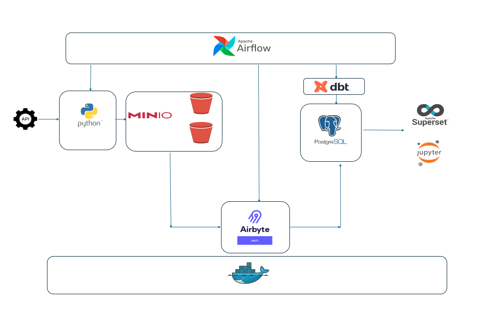

# Data Engineering Project – Modern Maritime Data Stack  
**ELT pipeline with Airflow, Airbyte, MinIO, Postgres, and dbt**  

This project implements a modern ELT architecture for ingesting, storing, and analyzing **real-time AIS (Automatic Identification System)** ship tracking data.  

- **Airflow (Astro CLI):** Orchestration of the entire pipeline  
 - **MinIO:** Object storage for raw & processed data  
 - **Airbyte:** Load data from MinIO to Postgres 
- **Postgres:** Data warehouse  
- **dbt:** Transformations & modeling (bronze → silver → gold)  
- **Superset:** Dashboards & visualization  

Dockerfiles and `docker-compose.yaml` were customized to handle services (`minio`, `postgres-destination`, `dbt`, and `superset`) and integrate them with Astro/Airflow.  
`.env` files are used for configuration.  

---

## Extract – From API to MinIO

The pipeline connects to the **AIS WebSocket stream**, processes incoming ship messages, and stores them in MinIO.  

### Features
- Real-time AIS data ingestion (Position, Static Data, Class B Reports)  
- Batch uploads of per-ship **snapshots** into MinIO as JSON Lines  
- Individual event logging (append-only) for traceability  
- Per-ship message fusion for accurate state tracking  
- Automatic reconnection with exponential backoff (Airflow task defaults)  
- Airflow-ready (e.g., scheduled every 3 minutes)  


### How It Works
1. **Connect to AIS WebSocket**  
   - Endpoint: `wss://stream.aisstream.io/v0/stream`  
   - Subscribes to global bounding box (`[-90, -180]` to `[90, 180]`)  
   - Filters for messages:  
     - `PositionReport`  
     - `ShipStaticData`  
     - `StandardClassBPositionReport`  
     - `LongRangeAisBroadcastMessage`  

2. **Fuse Messages by Ship**  
   - Group by `UserID` (ship identifier)  
   - Maintain per-ship state snapshot  

3. **Process & Upload**  
   - Append snapshots to batch → upload to MinIO (JSON Lines)  
   - Upload each raw event as individual JSON files  

### MinIO Buckets
| Bucket               | Description                               |
|-----------------------|-------------------------------------------|
| `MINIO_BUCKET`        | Batched snapshots (JSON Lines)           |
| `MINIO_BUCKET_EVENTS` | Individual event logs (single JSON files)|  

### Example Log Output
📡 Message Received Type: StandardClassBPositionReport
Processing Ship ID: 261002981
Uploaded batch position_report_20250815T090045603654_654f24.json with 58 records


### Error Handling
- Retries with exponential backoff (configurable, default: 5 retries)  
- Handles dropped WebSocket connections  
- Handles JSON parsing errors  

---

## Load – From MinIO to Postgres  

Data is loaded from MinIO to Postgres using **Airbyte**.  

### Custom Airbyte Sync Function
- Fetches a valid OAuth2 token  
- Waits for any ongoing sync to finish  
- Triggers a new sync and polls until completion  

This provides more control over **authentication, retries, and job tracking** compared to the default `AirbyteTriggerSyncOperator`.  

### Airbyte Setup
- Source: MinIO  
- Destination: Postgres  
- Connection: **Incremental + Deduped PK (UserID)**  
- Sync mode: Manual (triggered by Airflow)  
- Example Airbyte conn id for setting up connection in Airbyte
http://localhost:8000/workspaces/connections/<connection_id>/status  


---

## Transform – Modeling with dbt  

- **dbt transformations** applied in Postgres  
This project uses dbt to build a maritime data warehouse by processing, enriching, and modeling vessel-related data through multiple layered stages: `bronze`, `silver`, and `gold`. The latest update focuses on model modularization and KPI generation.

---

## Refactor Summary

### What was done:

- **Modularization** of previously monolithic models:
  - Extracted logic into clear and independent staging models (`stg_*`).
  - Created join logic in `stg_joins` to decouple heavy transformations from final outputs.

- **Refined the `silver` layer**:
  - Centralized data enrichment and validation.
  - Added semantic cleaning (e.g., trimming, normalization of `destination`, mapping flags, vessel types).

- **Built a `gold` layer** for business-consumable outputs:
  - Deduplicated records using `user_id` and `row_number()` to retain the most recent entry per vessel.
  - Added derived metrics like `speed_kmh`, `distance_to_destination_km` using the Haversine formula.
  - Filtered out outlier speeds (e.g., `speed_over_ground < 58` knots).


## KPIs Generated (Gold Layer)

The following models were built on top of the `gold` table to support analytical dashboards and reporting:

| KPI Model                            | Description                                                           |
|-------------------------------------|-----------------------------------------------------------------------|
| `kpi_avg_speep_country_day`         | Daily average/min/max speed per flag country                          |
| `kpi_arrival_by_destination`        | Number of vessels arriving per destination country                    |
| `kpi_avg_distance_to_destination`   | Average distance vessels are from their destination                   |
| `kpi_vessel_type_per_country`       | Distribution of vessel types per country                              |
| `kpi_port_vessel_traffic`           | Vessel count per destination port                                     |
| `kpi_unusual_traffic_area`          | Detects geographic grid cells with abnormal vessel concentration      |

---

## Model Layer Overview

- **`bronze`**: Raw ingestion and minimal parsing from Airbyte sources.
- **`silver`**: Enriched, cleaned, and joined records for analytical readiness.
- **`gold`**: Final, deduplicated dataset ready for KPI aggregation.
- **`kpi_*`**: KPI tables built from the `gold` model.

---

## Notes

- `user_id` is used as the deduplication key instead of `unique_row_id` to avoid overcounting vessels with multiple entries.
- Ensure that `speed_over_ground` and `latitude/longitude` values are properly validated at the `silver` layer.

---

## Run Instructions

```bash
# Full refresh of all models
dbt run --full-refresh

# Run only KPI models
dbt run --select kpi_*

# Test all models
dbt test  


- **Superset dashboards or Jupyter notebook** built on top of gold tables  

---

## Architecture Overview



